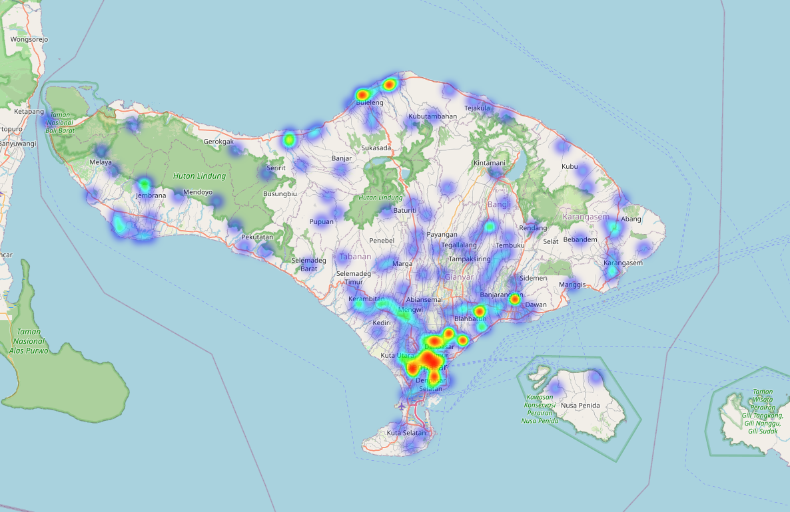

# SPPG Distribution Maps

Dikarenakan rasa gabut saya serta rasa penasaran saya yg amat tinggi wkwk <html>&#x1F639;</html> maka saya memutuskan melakukan plotting sebaran sppg di beberapa provinsi.
Btw ini sourcenya: https://auditsppg.id/

## Live site

Open the landing page at:
https://thofaa.github.io/sppg/

Click a province from the list to open its dot map or density heatmap.

## Added provinces

- **Aceh** - `aceh_sppg.html` / `aceh_sppg_heat.html`
- **Bali** - `bali_sppg.html` / `bali_sppg_heat.html`
- **Jawa Timur** - `jawa_timur_sppg.html` / `jawa_timur_heat.html`

## Contributing

**Verify latitude/longitude data.** The source of truth (mungkin) for every coordinate is the per-province JSON file in `latlong/<province>_sppg.json`. Each entry stores the `sppg_name`, `address`, and the geocoded `lat`/`lon`. Before trusting a coordinate (or before adding a province), open that file and cross-check the `lat`/`lon` values against the address — bad geocoding results are a common issue.
